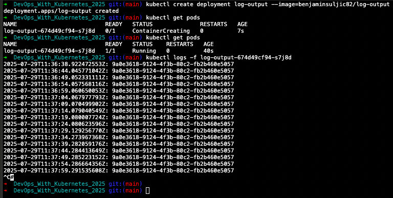

# Assignment 

Create an application that generates a random string on startup, stores this string into memory, and outputs it every 5 seconds with a timestamp. e.g.

2020-03-30T12:15:17.705Z: 8523ecb1-c716-4cb6-a044-b9e83bb98e43
2020-03-30T12:15:22.705Z: 8523ecb1-c716-4cb6-a044-b9e83bb98e43

Deploy it into your Kubernetes cluster and confirm that it's running with kubectl logs ...

# Solution 

- Application was built in Java. Source code can be found [here](https://example.com](https://github.com/benjaminsuljic/DevOps_With_Kubernetes_2025/blob/main/Part1/Exercise-1.1/app/logoutput/src/LogOutput.java)).
- Image was pushed to Docker Hub repo [benjaminsuljic82/log-output](https://hub.docker.com/repository/docker/benjaminsuljic82/log-output/general).
- The following commands were used to create and test Kubernetes deployment:

